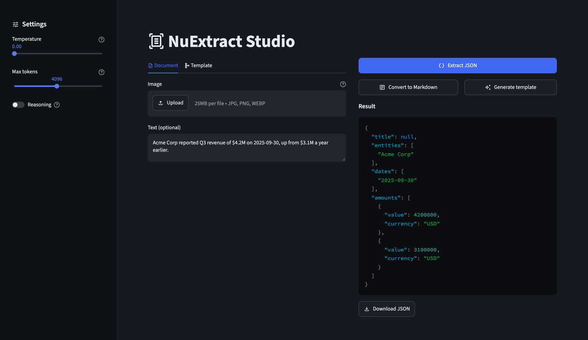

# NuExtract Studio

[](https://github.com/darylalim/nuextract-studio/actions/workflows/ci.yml)
[](LICENSE)
[](pyproject.toml)
[](#requirements)

Streamlit application for structured extraction, document understanding, and template generation with NuMind NuExtract on Apple Silicon with MLX. Mirrors the [official NuExtract3 Hugging Face Space](https://huggingface.co/spaces/numind/NuExtract3) but runs entirely locally via [mlx-vlm](https://github.com/Blaizzy/mlx-vlm) — no discrete GPU, CUDA, or external API required (inference runs on the Apple GPU via MLX/Metal).



## Features

- **Three modes** — structured JSON extraction, document-to-markdown conversion, and natural-language → template generation
- **Multimodal input** — upload an image (screenshot, scan, photo) and/or paste text
- **Typed template system** — `verbatim-string`, `string`, `integer`, `number`, `date`, `boolean`, enums, multi-enums, and more (see [TYPES.md on Hugging Face](https://huggingface.co/numind/NuExtract3/blob/main/TYPES.md))
- **Custom instructions** — an optional free-text field to steer extraction (e.g. "use British date format")
- **Tunable generation** — temperature (0.0–1.0, default 0.0) and max-tokens (256–8192, default 4096) sliders
- **Streaming output** — results stream in token-by-token
- **Optional reasoning mode** — for Extract JSON and Convert to Markdown, the model emits `<think>...</think>` traces shown in a dedicated pane (template generation always runs without reasoning)
- **Download buttons** — save the JSON, markdown, or generated template to disk
- **Local Apple Silicon inference** — no API key or network calls during extraction

## Requirements

- macOS with Apple Silicon (M1/M2/M3/M4)
- Python 3.12+ (installed automatically by uv — no separate Python setup needed)
- ~6 GB free disk — the model is ~5 GB (downloaded on first run), plus headroom
- 16 GB unified memory recommended (more is better for long-context inference)

## Quickstart

This project uses [uv](https://docs.astral.sh/uv/) for dependencies and Python. Install it first if you don't have it:

```bash
curl -LsSf https://astral.sh/uv/install.sh | sh
```

Then clone and run (uv installs a matching Python 3.12 and all dependencies for you):

```bash
git clone https://github.com/darylalim/nuextract-studio.git
cd nuextract-studio
uv sync
uv run streamlit run streamlit_app.py   # opens http://localhost:8501
```

**First run** downloads the ~5 GB model (on top of the Python dependencies pulled during `uv sync`), so budget a few minutes on a typical connection. The whole interface — inputs, action buttons, and both output panes — is on screen right away, with a "Loading model (first run downloads ~5 GB)" spinner sitting where results will appear. Anything you type or upload while the download runs is kept and applied once the model is ready, though the app can't redraw until then, so the image preview won't show yet. Download progress prints in the terminal, not the browser. Later runs load from the local Hugging Face cache in seconds. Press Ctrl-C in the terminal to stop the app.

## Modes

| Button | Inputs | Output |
|---|---|---|
| **Extract JSON** | Image and/or text + JSON template | Structured JSON matching the template |
| **Convert to Markdown** | Image (required) | Clean markdown with HTML tables and embedded structure |
| **Generate template** | Image or text describing the document | A JSON template you can paste back into the editor |

## Try it: your first extraction

The app opens with a ready-to-use JSON template, so you can extract from plain text with no setup:

1. Paste text into the **Text** box, e.g.:
   > Acme Corp reported Q3 revenue of $4.2M on 2025-09-30, up from $3.1M a year earlier.
2. Leave the default **Template (JSON)** as-is (it extracts `title`, `entities`, `dates`, and `amounts`).
3. Click **Extract JSON**.

JSON streams into the Result pane, for example:

```json
{
  "title": null,
  "entities": ["Acme Corp"],
  "dates": ["2025-09-30"],
  "amounts": [
    {"value": 4200000, "currency": "USD"},
    {"value": 3100000, "currency": "USD"}
  ]
}
```

Exact values vary with the model; fields it can't fill come back `null` (here the text has no explicit title). Then edit the template to change what gets pulled out, or upload an image and use **Extract JSON** / **Convert to Markdown** to work from a scan or screenshot.

## Limitations

- **No PDF support** — matches the upstream HF Space. Convert PDFs to images (PNG/JPG) externally before uploading.
- **One image per run** — the uploader takes a single image (JPG, JPEG, PNG, or WEBP); it does not batch multiple pages.
- **25 MB per image** — a browser-side bound on the uploader, sized for a single page scan. It is a widget hint, not a server-enforced limit.
- **No clipboard paste** — images must be uploaded as files (a Streamlit limitation vs the Gradio-based HF Space).
- **Apple Silicon only** — inference runs through MLX, which requires an arm64 Mac.

## Troubleshooting

- **`command not found: uv`** — install uv (see [Quickstart](#quickstart)), then restart your shell.
- **Not on Apple Silicon** — MLX runs only on Apple-Silicon Macs (M1–M4). On Intel Macs, Linux, or Windows the model will fail to load and there is no CPU/CUDA fallback. Use the [hosted HF Space](https://huggingface.co/spaces/numind/NuExtract3) instead.
- **First run looks stuck / Result pane spins** — it's downloading the ~5 GB model; watch progress in the terminal, not the browser. The rest of the interface is already on screen meanwhile. Interrupted downloads resume on the next run (Hugging Face caches partial files).
- **"Model failed to load"** — the error is shown in the Output pane with a **Retry model load** button. The failure is cached deliberately, so it won't retry itself on every click elsewhere in the app; use the button once you've fixed the cause.
- **Out of memory or very slow generation** — the 8-bit model needs ~5–6 GB of unified memory plus KV cache. On 16 GB machines, close other apps, lower **Max tokens**, and keep inputs shorter.
- **`Qwen3VLImageProcessor` / transformers errors** — dependency versions are pinned in `pyproject.toml` (notably `mlx-vlm==0.7.2` and `transformers==5.17.0`). Run `uv sync` to restore the locked versions and avoid upgrading these manually.

## Development

```bash
uv run --frozen ruff check .      # Lint
uv run --frozen ruff format .     # Format (add --check to verify without rewriting)
uv run --frozen ty check          # Type check
uv run --frozen pytest            # Tests (109)
```

`--frozen` is not optional here. A bare `uv run` locks and syncs by default, so with an out-of-date `uv.lock` it silently rewrites the lock in your working tree — every gate then passes against the regenerated lock while the committed one stays stale, and CI's `uv sync --locked` fails on `main`.

`uv run python scripts/probe_mlx_vlm.py` runs an end-to-end probe (downloads the model and performs a real extraction) to verify the setup on a fresh machine.

CI (GitHub Actions, `macos-15` Apple Silicon runners) runs lint, format check, type check, and tests on **every branch push**, on pull requests, and on demand via `workflow_dispatch`. The test suite needs no network and no model — it passes against an empty Hugging Face cache.

Releasing is automated by the same workflow: bump `version` in `pyproject.toml`, commit, and push to `main`. Once the four gates pass, CI tags `v<version>` and publishes a GitHub Release with notes built from the commit log. There is no separate `git tag` step — a version that is already tagged is simply skipped.

Optionally, enable the tracked git hooks so these gates run before each push (git does not share hooks itself, so this is opt-in per clone):

```bash
git config core.hooksPath .githooks
```

[`.githooks/pre-push`](.githooks/pre-push) runs `uv lock --check` plus all four CI gates — lint, format check, type check, tests — cheapest first, and aborts the push at the first failure. Bypass a single push with `git push --no-verify`.

## Project Structure

```
streamlit_app.py                    # UI: two-pane layout, buttons + streamed output in an st.fragment
nuextract.py                        # mlx-vlm wrapper: load, render prompt, stream extraction
pyproject.toml                      # Dependencies (pinned) + ruff/ty/pytest config
scripts/
  probe_mlx_vlm.py                  # Verifies model + template kwargs flow-through end-to-end
tests/
  conftest.py                       # sys.path setup + guard: no test may load a real model
  test_nuextract.py                 # Wrapper tests (47)
  test_streamlit_app.py             # App helper tests (29)
  test_streamlit_app_apptest.py     # End-to-end UI tests via Streamlit AppTest (33)
.githooks/
  pre-push                          # Runs uv lock --check + all four gates before a push
                                    # (opt-in: git config core.hooksPath .githooks)
.github/workflows/
  ci.yml                            # Lint + format check + type check + pytest on macOS runners,
                                    # then auto-release when pyproject.toml's version is bumped
```

## Contributing

Contributions are welcome. Before opening a PR against `main`, run the same gates CI enforces — all must pass:

```bash
uv run --frozen ruff check .
uv run --frozen ruff format --check .
uv run --frozen ty check
uv run --frozen pytest
```

Add or update tests where practical; the suite mocks the model so it runs fast and needs no network (currently 109 tests). Enabling `git config core.hooksPath .githooks` runs all four of these gates, plus `uv lock --check`, automatically before each push. See [CLAUDE.md](CLAUDE.md) for an architecture overview.

## Acknowledgments

- Mirrors the architecture of the official [NuExtract3 Hugging Face Space](https://huggingface.co/spaces/numind/NuExtract3) (MIT) by [NuMind](https://numind.ai), reimplemented for local Apple Silicon inference.
- Uses the [`numind/NuExtract3`](https://huggingface.co/numind/NuExtract3) model (Apache-2.0, built on Qwen3.5-4B), run via the [`numind/NuExtract3-mlx-8bits`](https://huggingface.co/numind/NuExtract3-mlx-8bits) quantization. The model weights are downloaded at runtime, pinned to a fixed upstream commit, and are not redistributed by this project.
- Built on [mlx-vlm](https://github.com/Blaizzy/mlx-vlm) and [Streamlit](https://streamlit.io).

## License

Released under the [MIT License](LICENSE). The NuExtract model weights are licensed separately (Apache-2.0) by NuMind.
